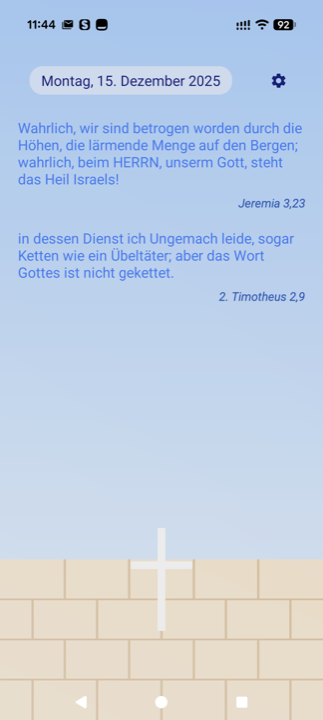
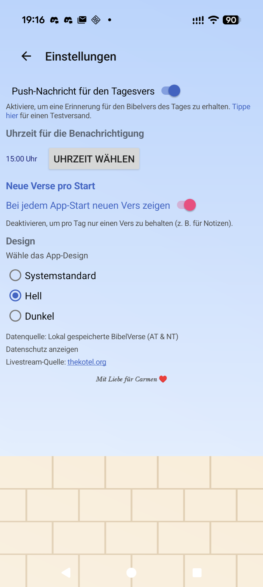
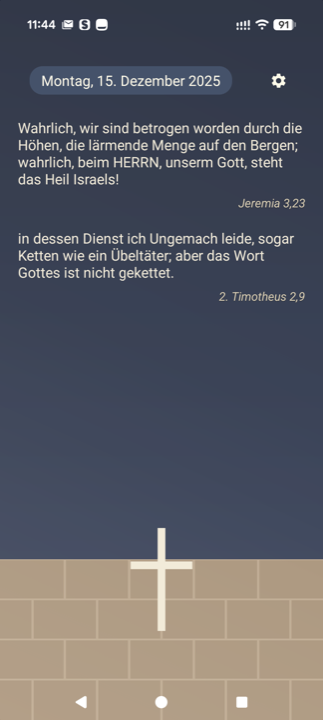
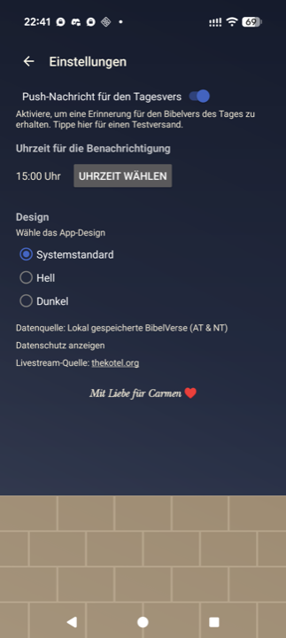

# BibelVers Android App

Eine kleine Android-App, die jeden Tag einen zufällig kombinierten Bibelvers (Altes &amp; Neues Testament) aus einer lokal mitgelieferten Sammlung zeigt, dazu einen Livestream von der Klagemauer anbietet und optionale Push-Benachrichtigungen versendet.

## Features
- BibelVerse: vollständig offline verfügbare Verspaare aus AT und NT, einmal pro Jahr zufällig durchgemischt, damit keiner doppelt vorkommt
- Livestream-Auswahl (Kotel-Kameras) mit randloser Wiedergabe im Querformat
- Wischgesten (links/rechts) zum Blättern zwischen Tagen
- Benachrichtigungen für den Tagesvers (inkl. Testtrigger über die Datenquelle)
- Shabbat-Hinweis am Freitagabend/Samstag

## Build
1. Vorlage übernehmen (einmal pro Rechner):
   ```
   cp build.template.sh build.sh
   chmod +x build.sh
   ```
   Passe `build.sh` bei Bedarf an (z. B. Keystore-Pfade) – die Datei bleibt lokal und ist in `.gitignore`.
2. Build starten:
   ```
   ./build.sh
   ```

Vor dem ersten Lauf prüfen, ob folgende Tools installiert sind (macOS: Homebrew wird automatisch genutzt):
- Temurin JDK 17
- Android SDK (Pfad via ANDROID_HOME / ANDROID_SDK_ROOT oder auto-generierte `local.properties`)
- Gradle Wrapper (liegt im Repo)

Abhängigkeiten prüfen & Build starten:
```
# optional: SDK/Plattformen aktualisieren
./scripts/update_android_sdk.sh

# Debug-Build erzeugen
./build.sh debug
# oder Release-Bundle samt Signatur
./build.sh release
```
APK liegt danach unter `app/build/outputs/apk/debug/app-debug.apk`.

## Hinweise
- Alle BibelVerse liegen bereits im APK (`app/src/main/assets/BibelVerse.xml`). Es gibt keine Downloads von externen Quellen.
- Für die Livestreams wird ein direkter HLS-Stream über ffplay-kompatible URLs verwendet.

## Screenshots (Pixel 10 – Hell)



## Screenshots (Pixel 10 – Dunkel)



## Datenschutz
Die für den Google Play Store verlinkte Datenschutzerklärung liegt unter [docs/datenschutz.html](https://henosch.github.io/BibelVersApp/datenschutz.html). Beim lokalen Build wird dieselbe Datei innerhalb der App ausgeliefert.
